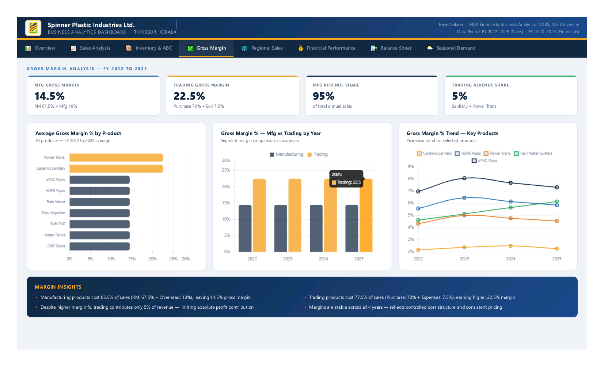
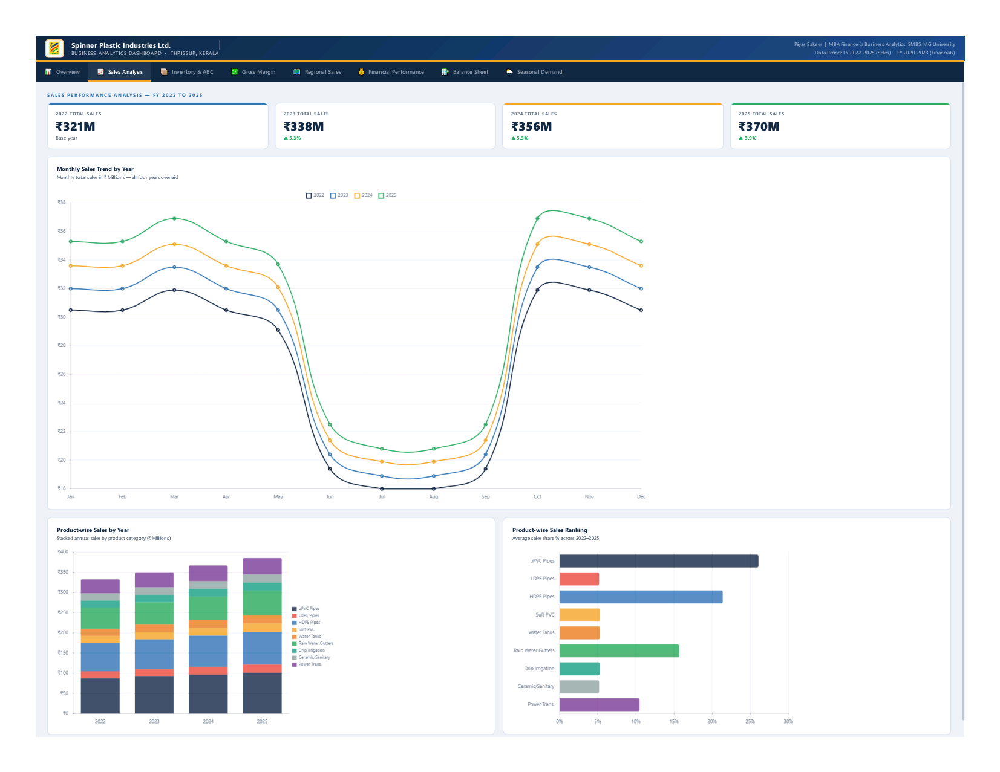

# 📊 Sales & Inventory Analytics
## Spinner Plastic Industries Limited — Thrissur, Kerala

> **MBA Academic Project** | Finance & Business Analytics (2024–26)
> School of Management and Business Studies, Mahatma Gandhi University, Kottayam

---

## 🔗 Live Interactive Dashboard

👉 **[Click here to open the Analytics Dashboard](https://YOUR-USERNAME.github.io/spinner-plastic-analytics/dashboard/Spinner_Dashboard_Pro.html)**

> 8-tab Power BI style dashboard. Opens directly in browser. Best viewed in Chrome.

---

## 🏭 About the Company

**Spinner Plastic Industries Limited**, Thrissur, Kerala — Established 1992.
ISI certified manufacturer of plastic pipes, sanitary ware, and water tanks.

| Field | Details |
|-------|---------|
| Study Period | FY 2022–2025 (Sales) · FY 2020–2023 (Financials) |
| Tools Used | Microsoft Power BI · Microsoft Excel · Python (Matplotlib) |
| Dataset | 10 structured tables · 27 analytical visuals |
| Products | 9 categories — Manufacturing & Trading segments |

---

## 📈 Dashboard Preview

---

## 🔍 Analysis Covered

| # | Analysis | Key Finding |
|---|----------|-------------|
| 1 | Sales Trend | Revenue ₹321M → ₹370M at 5% YoY |
| 2 | Product Performance | uPVC 26% · HDPE 21% top drivers |
| 3 | Cost of Production | Raw material = 67.5% of sales |
| 4 | Manufacturing vs Trading | Mfg 14.5% · Trading 22.5% margin |
| 5 | Gross Margin | Overall ~18.57% stable all years |
| 6 | Seasonal Demand | Peak 111.25 vs Off-peak 67.50 |
| 7 | Inventory & ABC | 3 Category A products = 60% value |
| 8 | Regional Sales | South Kerala = zero sales (opportunity) |
| 9 | Financial Performance | Net margin ~5.01% · Loan reducing |

---

## 📁 Repository Contents

| Folder | Contents |
|--------|----------|
| [dashboard/](dashboard/) | Interactive 8-tab analytics dashboard |
| [report/](report/) | Full MBA project report (Word) |
| [dataset/](dataset/) | 10-sheet Excel dataset |
| [presentation/](presentation/) | Viva voce PowerPoint — 22 slides |
| [charts/](charts/) | All 27 chart images |

---

## 👤 About

**Riyas Sakeer**
MBA — Finance & Business Analytics (2024–26)
School of Management and Business Studies
Mahatma Gandhi University, Kottayam, Kerala

Faculty Guide: Dr. Madhu Lal M · Assistant Professor, SMBS
Company Guide: Mr. P.J. Jaison · Executive Director, Spinner Plastic Industries Ltd.

---

*Project submitted: July 2026 · Data provided by Spinner Plastic Industries Limited, Thrissur*