# 📈 Charts & Figures

All analytical charts generated for the project report.
Built using Python (Matplotlib) and Microsoft Power BI Desktop.

---

## Sales Trend Analysis

### Year-wise Total Sales (Figure 4.1)
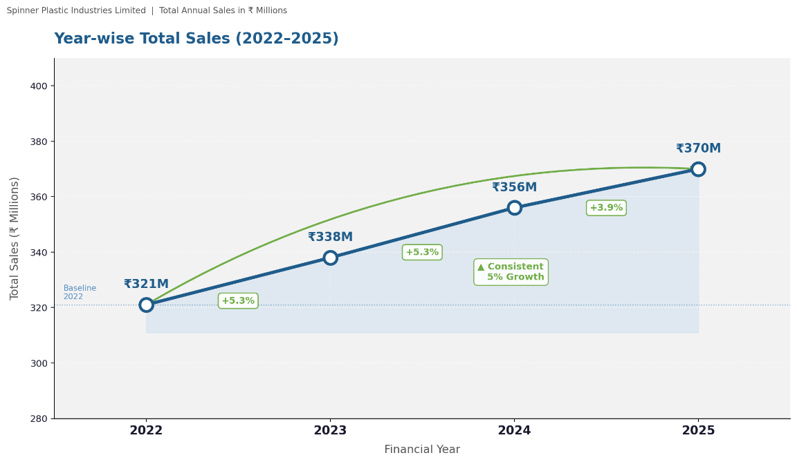

### Monthly Sales Trend by Year (Figure 4.2)
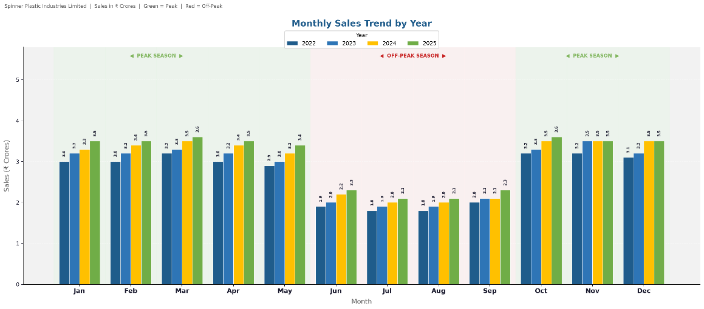

### Product-wise Sales by Year (Figure 4.3)
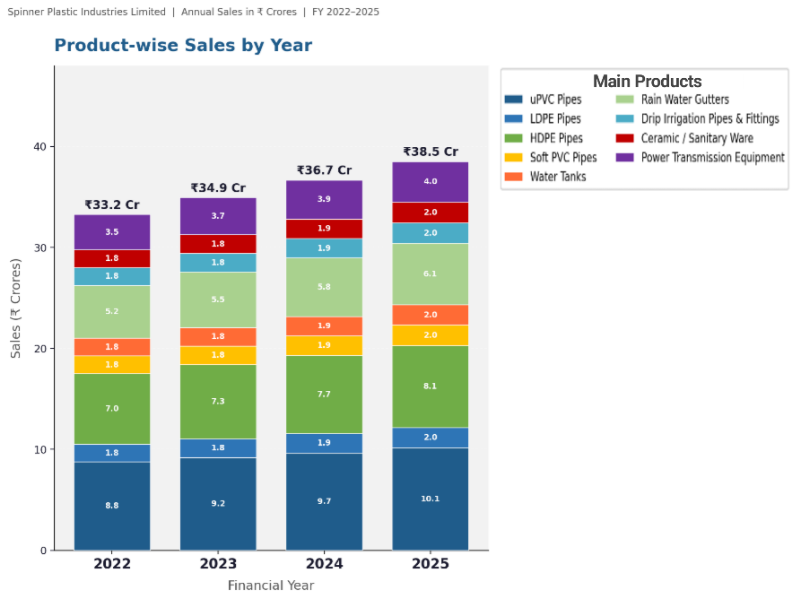

### Product Sales Distribution 2025 (Figure 4.4)
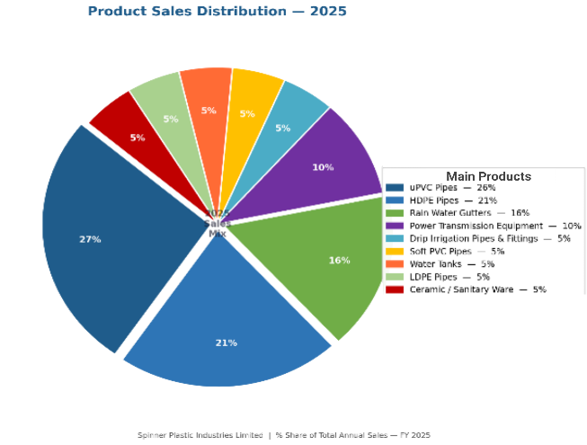

### Category-wise Sales Trend (Figure 4.5)
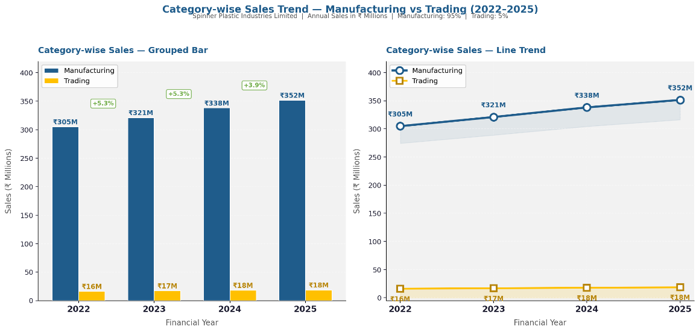

---

## Cost of Production Analysis

### Cost Structure by Product Line (Figure 4.9)
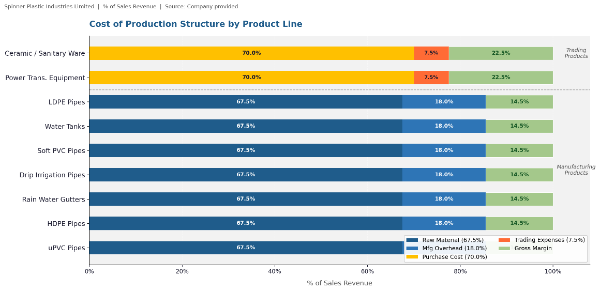

---

## Gross Margin Analysis

### Average Gross Margin % by Product (Figure 4.12)
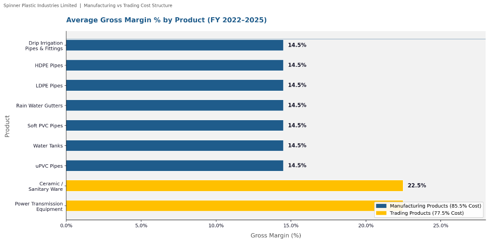

### Gross Margin % — Manufacturing vs Trading (Figure 4.11)
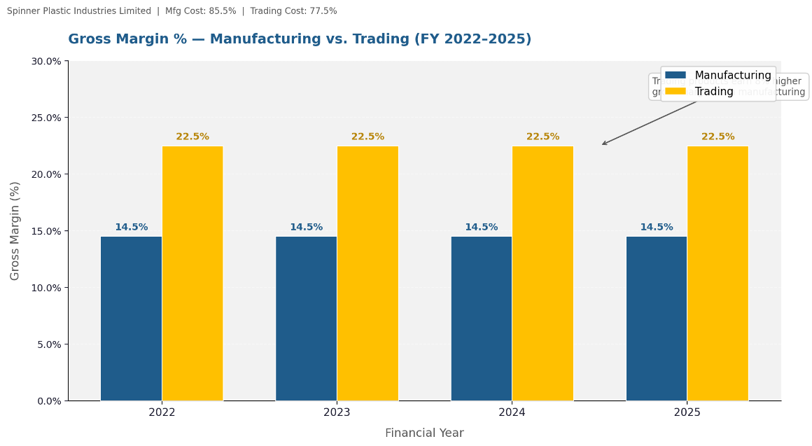

### Gross Margin % Trend by Product (Figure 4.13)
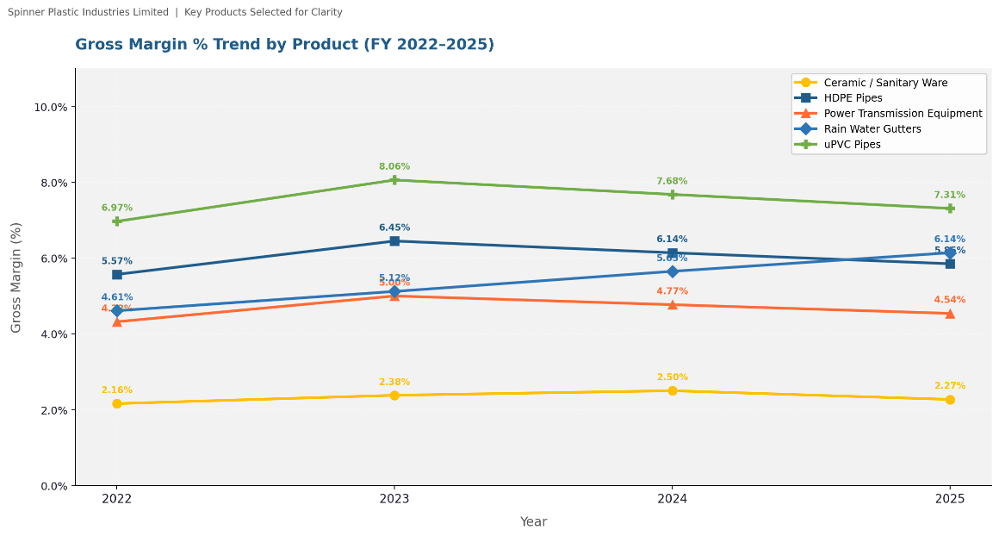

---

## Inventory Analysis

### Inventory Turnover Ratio (Figure 4.18)
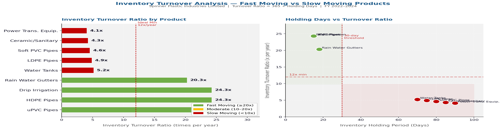

---

## Regional Sales Analysis

### District-wise Sales Index — Kerala (Figure 4.19)
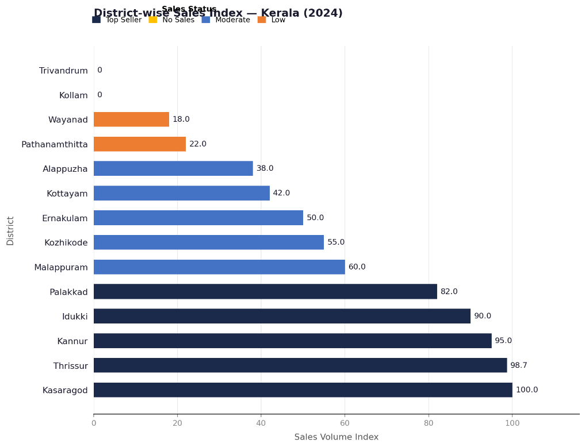

---

## Financial Performance Analysis

### Major Expense Breakdown (Figure 4.23)
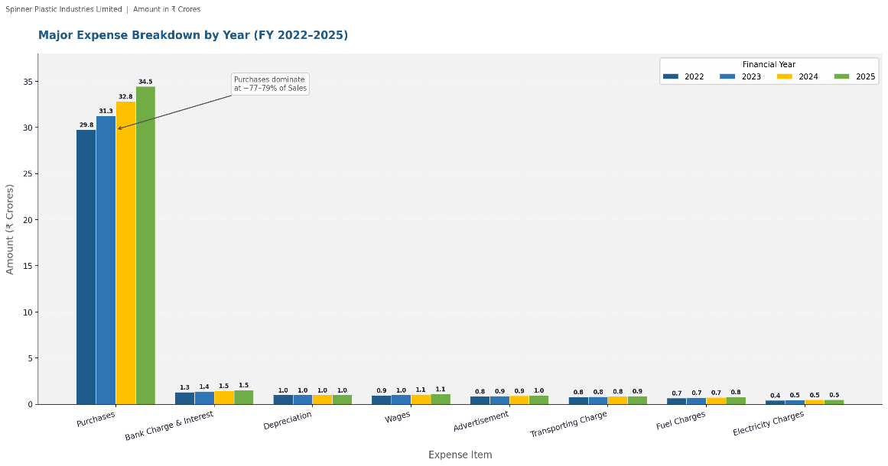

