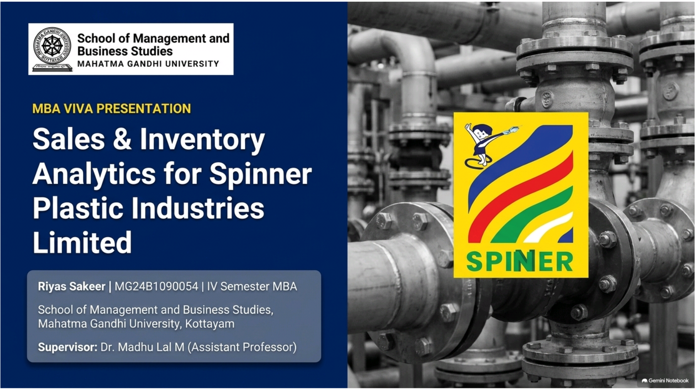
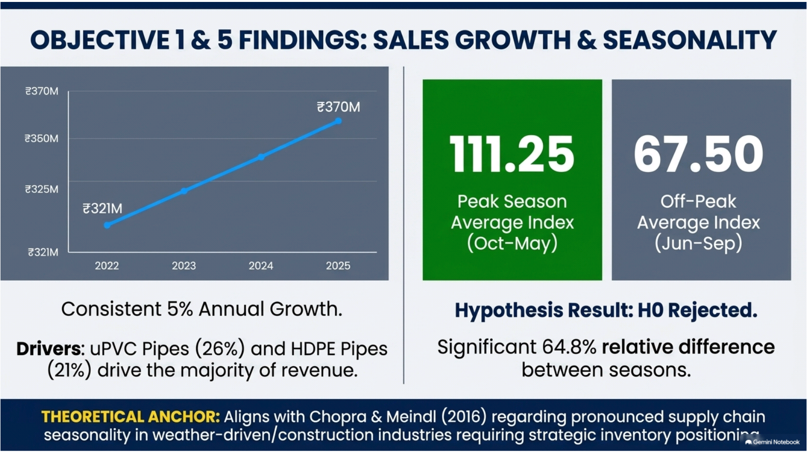
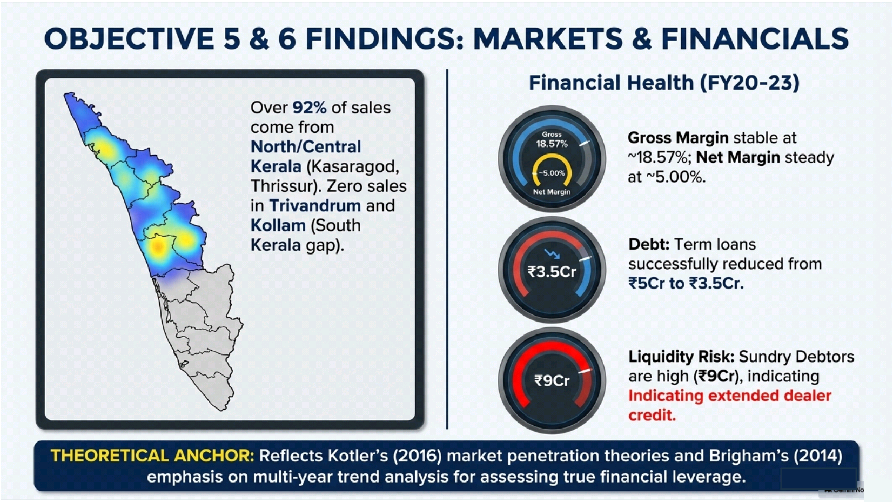

# 🎤 Viva Voce Presentation

## File
`Spinner_Viva_PPT_v2.pptx`

-------
## Dashboard Preview

--------
## Slide Structure

| Slide | Content |
|-------|---------|
| 1 | Title — Name, Institution, Faculty Guide |
| 2 | Contents |
| 3 | Review of Literature (10 authors) |
| 4 | Theoretical & Conceptual Framework |
| 5 | Problem Statement & Objectives |
| 6 | Methodology Matrix + Hypothesis |
| 7 | Findings — Objectives 1 & 2 |
| 8 | Findings — Objectives 3 & 4 |
| 9 | Findings — Objectives 5 & 6 |
| 10 | Recommendations — Objective 7 |
| 11 | Conclusion |
| 12 | Thank You |
| 13+ | Chapter 4 Figures (one slide per section) |

## Details
- Total slides: 22 (12 main + 10 chapter 4 figure slides)
- Theme: Navy blue and white — formal academic
- Logos: SMBS MG University + Spinner Plastic Industries
- Format: MG University S4 MBA Viva Voce — 12 slide structure